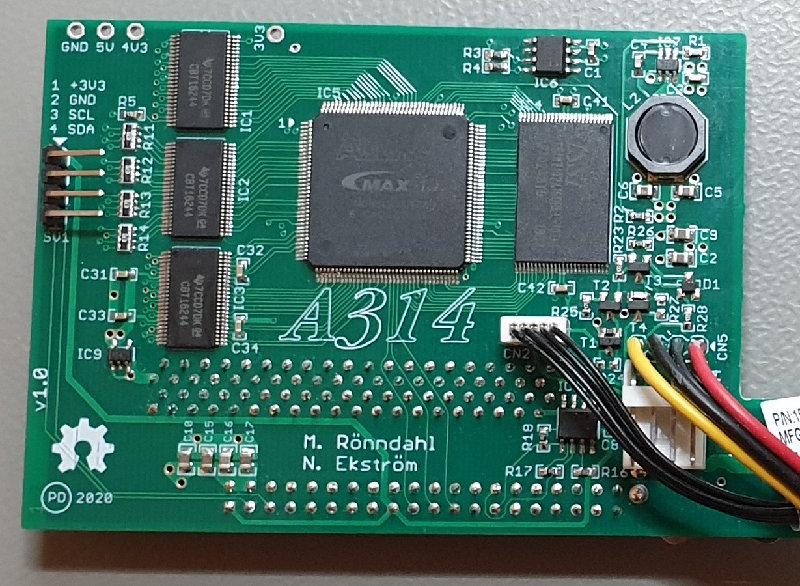
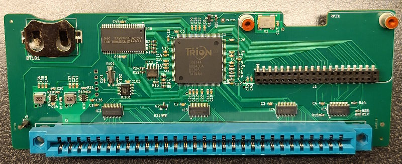
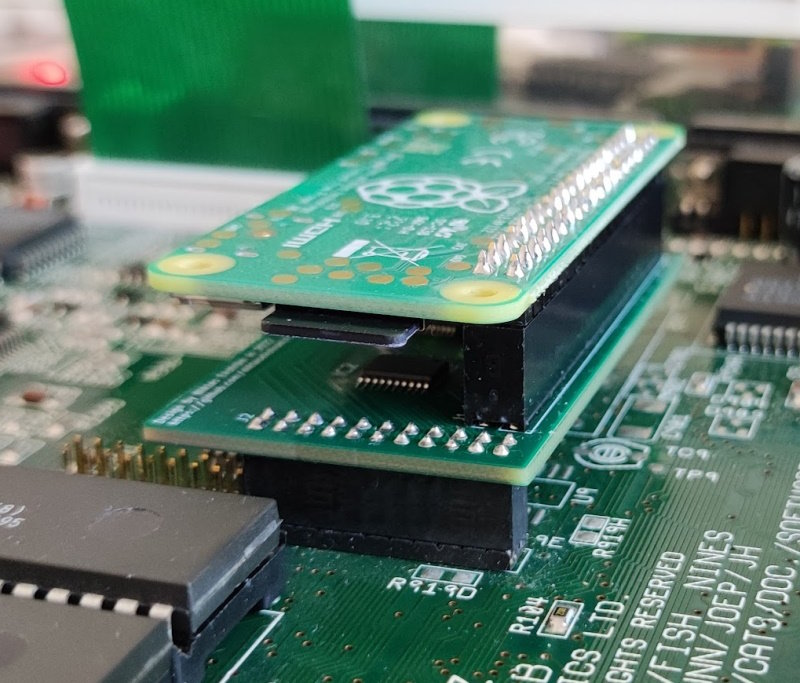

# A314

## What is it?

*A314* is a family of expansions for Amiga computers that lets a Raspberry Pi
(RPi) be used as a co-processor to the Amiga.

The Amiga and the RPi communicate through a shared memory that resides on the
A314 board. A communication protocol is implemented on top of the shared memory,
that allows programs on the Amiga to establish logical communication channels to
*services* running on the RPi. The protocol is handled by drivers on each side,
[*a314.device*](Software/a314device) on the Amiga and [*a314d*](Software/a314d)
on the RPi. The drivers are responsible for multiplexing packets from the logical
channels and notifying the receiving side when a packet is available, using interrupts.

## Hardware variants

Initially there was a single variant of A314 that connected to the trapdoor
on an Amiga 500. Since then several more variants have been developed for
different Amiga models. The same software run on the different hardware variants.

The design files for the different hardware variants are available in separate
repositories. The currently available variants are:

| Variant | Amiga model | Connector | GitHub repository |
|---------|-------------|-----------|-------------------|
| A314-500 | Amiga 500 | Trapdoor | <https://github.com/Eriond/A314-500-PCB> |
| A314-600 | Amiga 600 | Trapdoor | <https://github.com/Eriond/A314-600-PCB> |
| A314-1000 | Amiga 1000 | Front expansion | <https://github.com/Eriond/A314-1000-PCB> |
| A314-cp | Any Amiga with clockport | Clockport | <https://github.com/niklasekstrom/clockport_pi_interface>   <https://github.com/Eriond/clockport_pi_interface> (alternative PCB layout) |

|         |            |
| ------------- |---------------|
|  |  |
|  |  |

The A314 software has also been adapted to run on the Musashi version of
[PiStorm](https://github.com/captain-amygdala/pistorm).

## What can you do with it today?

We have implemented a few services that run on the RPi and on the Amiga:

- [*a314fs*](Software/a314fs) is a file system that is mounted in AmigaDOS as the PI0: device.
The volume in PI0: is called PiDisk:, and is mapped to a directory in the RPi.

- [*pi*](Software/picmd) is a command that lets you invoke executables on the RPi from the AmigaDOS CLI. For example, if your current working directory is on PiDisk: and you run `pi vc hello.c -o hello`, then the vc program (the VBCC cross-compiler) is executed on the RPi with the given arguments. It will cross-compile `hello.c` into the Amiga executable file `hello`. The resulting binary is immediately accessible through the a314fs.  
You may also launch Interactive applications using the pi command, such as `pi mc -a` which will run Midnight Commander. Running pi without any arguments is equivalent to `pi bash` and will present you with a bash prompt from the RPi.

|         |            |
| ------------- |---------------|
|   |  |

- [*PiAudio*](Software/piaudio) lets the RPi stream audio samples directly to the shared chip memory, from where Paula plays those samples. PiAudio is integrated with [ALSA](https://www.alsa-project.org) on the RPi so that any program that plays audio through ALSA can be used, i.e. "pi mpg123 -a amiga song.mp3" plays song.mp3 using the program mpg123 to the Amiga.

- [*RemoteWB*](Software/remotewb) works by moving the Workbench bitplanes over to the chip memory on the A314. This requires that the A500 has at least a 8372 Agnus. During drawing of each frame on the Amiga, the RPi reads those bitplanes, encodes them into a [GIF image](Software/bpls2gif), and transmits that image to a web browser through a web socket. The web browser in turn, returns key presses and mouse movements back to the Amiga through the same web socket. In effect, this becomes a web browser based remote control application, comparable to VNC but with near zero performance impact on the Amiga CPU!

- [*VideoPlayer*](Software/videoplayer) is a simple program that displays a sequence of images on the A500 by letting the RPi write bitplanes directly to the shared memory (this again requires that the A314 memory is chip memory, and not "ranger" memory).

- [*a314eth.device*](Software/ethernet) is a SANA-II driver that forwards Ethernet packets to the network interface of the RPi. Together with an Amiga TCP/IP stack this provides network access to the Amiga.

- [*a314disk.device*](Software/disk) mounts an ADF or HDF file on the RPi as a disk drive on the Amiga.

- [*PiHid*](Software/hid) takes input events from mouse and keyboard that are
connected to the RPI with USB, and forwards those input events to input.device
in the Amiga.

## What could it potentially be used for in the future?

Here are some services that we have considered but not gotten around to implement:

- Networking through a *bsdsocket.library* implementation that forwards socket operations to the RPi and executes those operations there. This would give a higher degree of offloading than using the SANA-II driver with a TCP/IP stack running on the Amiga. The start of such a service is available
in the `libremote` branch.

- Your ideas?

## Do you want to get involved?

If this sounds interesting, you'll probably want an A314 of your own to play with.
All the information needed to build boards is freely available in the hardware
GitHub repositories linked to above.

The source code for the A314 software that runs on the Amiga and on the RPi is
available in the [Software](Software) directory.

There is a Discord server for discussing A314. [Here's the invite link](https://discord.gg/TGZNKnA).
