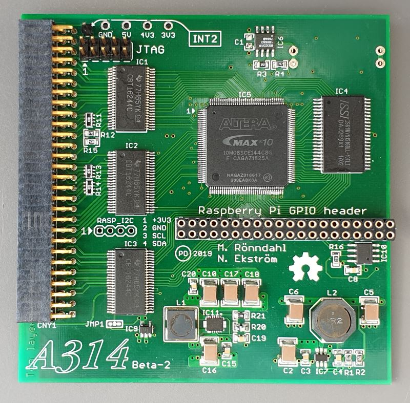
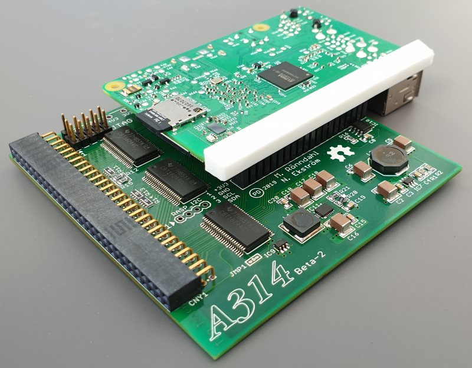
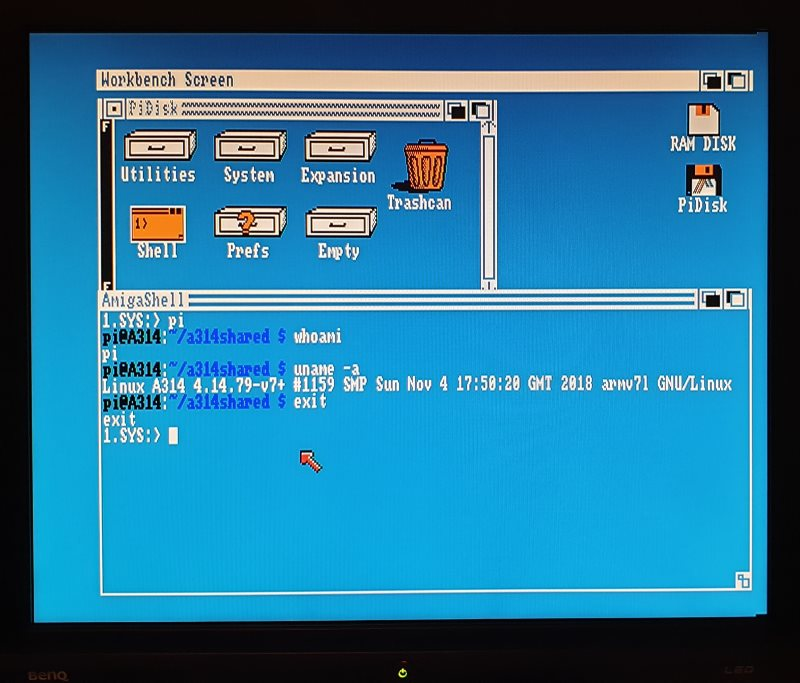
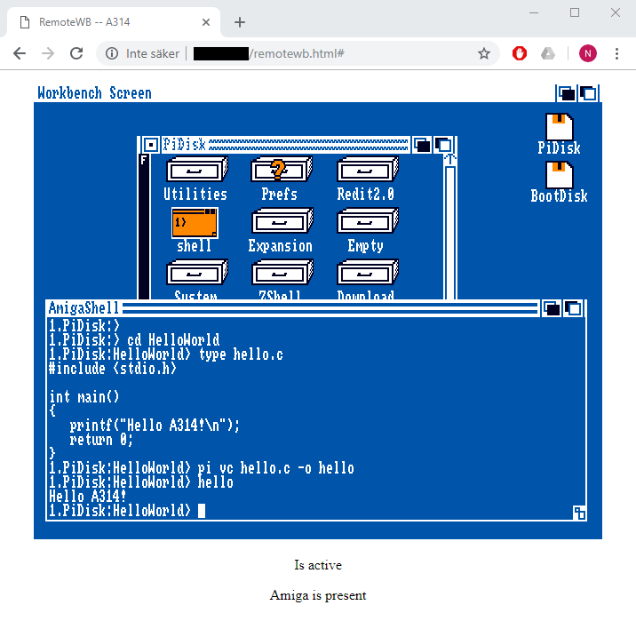

# A314

## What is it?

The *A314* is an expansion board for the Amiga 500 that goes in the trapdoor expansion slot. A Raspberry Pi (RPi) is attached to the A314, and the A500 and the RPi can communicate through a shared memory.

|         |            |
| ------------- |---------------|
|       |  |

We have constructed a communication protocol through which associated processes on each platform (Amiga and RPi) can allocate logical channels, carried over one physical SPI channel. The protocol is handled by a driver on each side ([*a314.device*](Software/a314device) on the Amiga and [*a314d*](Software/a314d) on the RPi). The drivers are responsible for alerting receiving processes of incoming data via an interrupt.

## What can you do with it today?

We have implemented a few services that run on the RPi and on the A500:

*  [*a314fs*](Software/a314fs) is a file system that is mounted in AmigaDOS as a device, PI0:  
The volume in PI0: is called PiDisk:, and is mapped to a directory in the RPi.

*  [*pi*](Software/picmd) is a command that lets you invoke executables on the RPi from the AmigaDOS CLI. For example, if your current working directory is on PiDisk: and you run "pi vc hello.c -o hello", then the vc program (the VBCC cross-compiler) is executed on the RPi with the given arguments. It will cross-compile “hello.c” into the Amiga executable file “hello”. The resulting binary is immediately accessible through the a314fs.  
You may also launch Interactive applications using the pi command, such as "pi mc -a" which will run Midnight Commander. Running pi without any arguments is equivalent to "pi bash" and will present you with a bash prompt from the RPi.

|         |            |
| ------------- |---------------|
|   |  |

* [*PiAudio*](Software/piaudio) lets the RPi stream audio samples directly to the shared chip memory, from where Paula plays those samples. PiAudio is integrated with [ALSA](https://www.alsa-project.org) on the RPi so that any program that plays audio through ALSA can be used, i.e. "pi mpg123 -a amiga song.mp3" plays song.mp3 using the program mpg123 to the Amiga.

*  [*RemoteWB*](Software/remotewb) works by moving the Workbench bitplanes over to the chip memory on the A314. This requires that the A500 has at least a 8372 Agnus. During drawing of each frame on the Amiga, the RPi reads those bitplanes, encodes them into a [GIF image](Software/bpls2gif), and transmits that image to a web browser through a web socket. The web browser in turn, returns key presses and mouse movements back to the Amiga through the same web socket. In effect, this becomes a web browser based remote control application, comparable to VNC but with near zero performance impact on the Amiga CPU!

*  [*VideoPlayer*](Software/videoplayer) is a simple program that displays a sequence of images on the A500 by letting the RPi write bitplanes directly to the shared memory (this again requires that the A314 memory is chip memory, and not "ranger" memory).

* [*ethernet*](Software/ethernet) is a SANA-II driver that forwards Ethernet packets to the network interface of the RPi. Together with an Amiga TCP/IP stack this provides network access to the Amiga.

## What could it potentially be used for in the future?

Here are some services that we have considered but not gotten around to implement:

* Networking through a *bsdsocket.library* implementation that forwards socket operations to the RPi and executes those operations there. This would give a higher degree of offloading than using the SANA-II driver with a TCP/IP stack running on the Amiga.

* Your ideas?

## Do you want to get involved?

If this sounds interesting, you'll probably want an A314 of your own to play with. We have released all the information needed to make a board, freely available in this GitHub repository.

In the [Hardware](Hardware) directory there are [schematics](Hardware/v1.1/Schematics/A314v1.1.pdf) and [Gerber files](Hardware/v1.1/Gerbers) that can be used to produce a PCB.

The Verilog source code used to generate a programming object file (.pof) for the Intel MAX 10 FPGA is available in the [HDL](HDL) directory. You'll need a USB-Blaster download cable (or a clone) to connect to the JTAG connector on the A314 board. You can compile the design using the [Quartus Prime Lite Edition](http://fpgasoftware.intel.com/?edition=lite).

The source code for the software that runs on the Amiga and on the RPi is available in the [Software](Software) directory.

If you have an idea about something cool to make using the A314, but you don't have the means to build a PCB on your own, then we have a small number of pre-built boards that we plan to hand out, given the idea sounds interesting enough. Send a message to Eriond on EAB and describe what you would like to make, and perhaps you can get one.

There used to be an IRC channel for discussing A314, but we have since moved to Discord. [Here's the invite link](https://discord.gg/TGZNKnA).
